# Module 11 Challenge: Forecasting Net Prophet

## Background

In this scenario, you’re a growth analyst at [Mercado Libre](http://investor.mercadolibre.com/investor-relations). With over 200 million users, Mercado Libre is the most popular e-commerce site in Latin America. You've been tasked with analysing the company's financial and user data in clever ways to help the company grow.

In a bid to drive revenue, you’ll produce a Jupyter notebook that contains your data preparation, your analysis, and your visualisations for all the time series data that the company needs to understand.

## Instructions

Original Instructions included in the Instructions.md file

### Step 1: Find Unusual Patterns in Hourly Google Search Traffic

The data science manager at Mercado Libre asks you if the Google search traffic for the company links to any financial events at the company. Or, does the search traffic data just present random noise? To answer this question, you’ll pick out any unusual patterns in the Google search data for the company, and connect them to the corporate financial events.

1. Review the data to just the month of May 2020 as this is when Mercado Libre released its quarterly financial results. Use hvPlot to visualise the results. Do any unusual patterns exist?

* From looking at the graph below, I would say that an unusual search pattern does exist.  Every day, there is lots of activity at night with traffic dropping off in the morning.  We can see this trend every day.

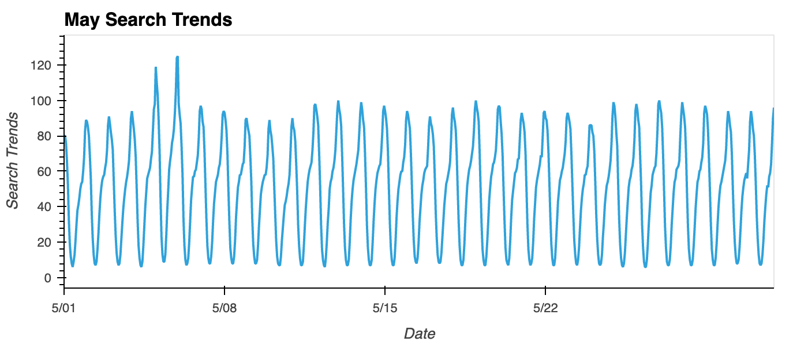

2. Calculate the total search traffic for the month, and then compare the value to the monthly median across all months. Did the Google search traffic increase during the month that Mercado Libre released its financial results?

* Based on this analysis, the search traffic did increase in the month of May 2020.  Total Search Traffic in May 2020 was $38,181 vs the monthly median of $35,172.

### Step 2: Mine the Search Traffic Data for Seasonality

The Marketing department realises that they can use the hourly search data, too. If they can track and predict interest in the company and its platform for any time of day, they can focus their marketing efforts around the times that have the most traffic. This will get a greater return on investment (ROI) from their marketing budget.

1. Group the hourly search data to plot the average traffic by the day of the week (for example, Monday vs. Friday).

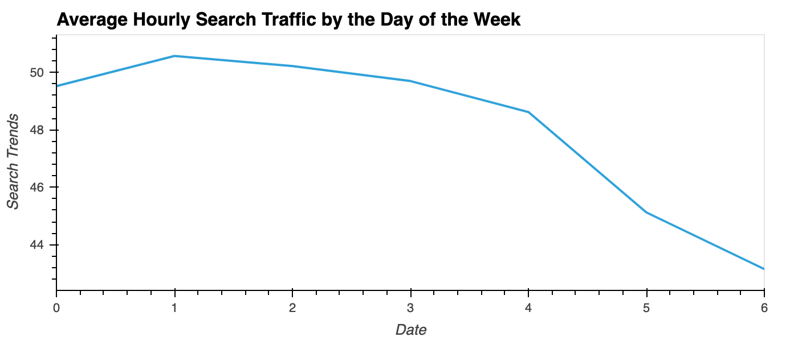

2. Using hvPlot, visualise this traffic as a heatmap. Does any day-of-week effect that you observe concentrate in just a few hours of that day?

* You can see from the heatmap below that most days demonstrate the same trends.  Traffic is very light in the morning (5:00am - 11:00am) and very heavey at night (10:00pm to 1:00am).

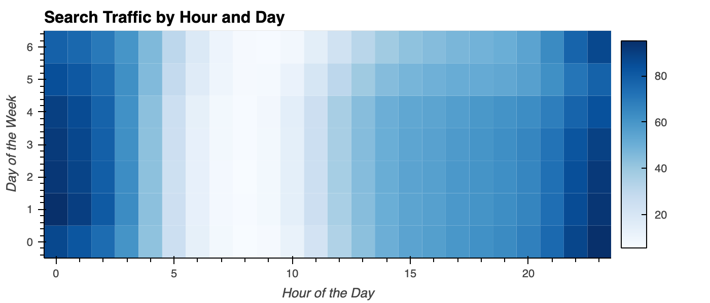

3. Group the search data by the week of the year. Does the search traffic tend to increase during the winter holiday period (weeks 40 through 52)?

* Looking at the heatmap below, it does not look like traffic increases significantly during the winter holiday period (week 40 through 52).

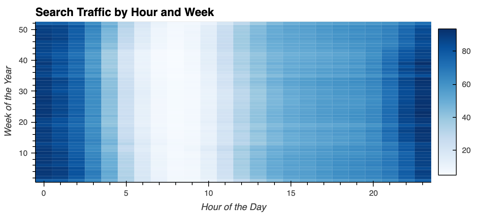

### Step 3: Relate the Search Traffic to Stock Price Patterns

During a meeting with people in the Finance group, you mention your work on the search traffic data. They want to know if any relationship between the search data and the company stock price exists, and they ask if you can investigate.

1. Review the stock price data in a line graph.

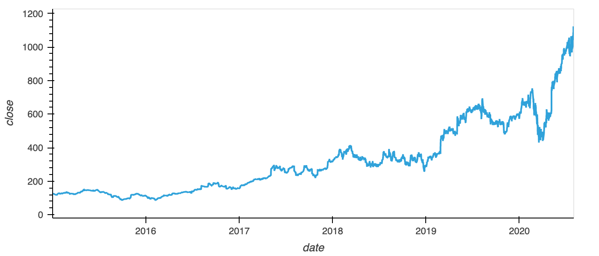

2. Note that market events emerged during 2020 that many companies found difficult. But after the initial shock to global financial markets, new customers and revenue increased for e-commerce platforms. So, slice the data to just the first half of 2020 (`2020-01` to `2020-06` in the DataFrame), and then use hvPlot to plot the data. Do both time series indicate a common trend that’s consistent with this narrative?

* Looking at the graphs below, we can see that there is a bit of a common trend between Search Trends and Closing price.  However, it is not very prevelant.  The exception of this is May 5th where we can see that both the Search Trends and the Close Price took a huge jump.

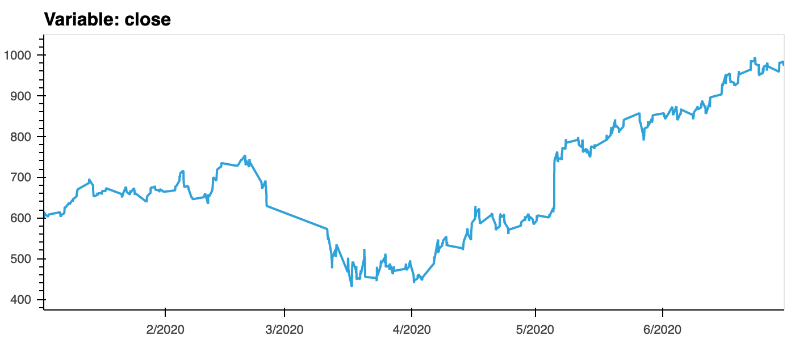
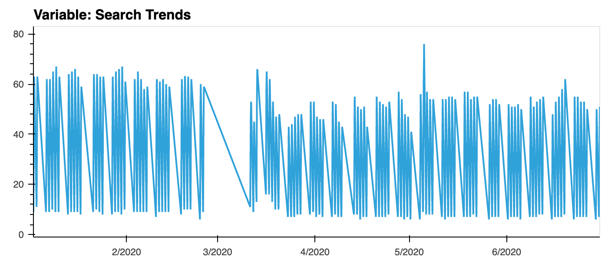

4. Create three additional columns in the DataFrame:
   * “Lagged Search Trends” that offsets, or shifts, the search traffic by one hour. 

   * “Stock Volatility”, which holds an exponentially weighted four-hour rolling average of the company’s stock volatility

   * “Hourly Stock Return”, which holds the percentage of change in the company stock price on an hourly basis

* Review the time series correlation.  Does a predictable relationship exist between the lagged search traffic and the stock volatility or between the lagged search traffic and the stock price returns?

* As we can see from the Heatmap below, there is very little correlation (-0.12) between 'lagged search trends' and 'stock volatility'.  There is even less correlation (0.018) between the 'lagged search trends' and 'hourly stock returns'.  Therefore, a predictable relationship does not exist between any of these points.

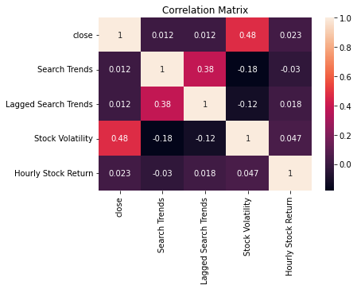

### Step 4: Create a Time Series Model by Using Prophet

Now, you need to produce a time series model that analyses and forecasts patterns in the hourly search data. Complete the following steps to create the model:

1. After estimating the Prophet model, plot the forecast. What is the near-term forecast for the popularity of Mercado Libre?

* Looking at the Prophet predictions graph below, we can see that the near-term forecast for the popularity of MercadoLibre is on a downward trend.

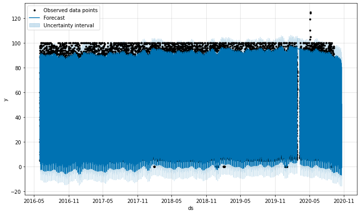

2. Plot the individual time series components of the model to answer the following questions:

   * What time of day exhibits the greatest popularity?
      * Midnight exhibits the greatest popularity.

   * Which day of the week gets the most search traffic?
      * Tuesday gets the most search traffic.

   * What's the lowest point for search traffic in the calendar year?
      * October is the lowest point for search traffic.

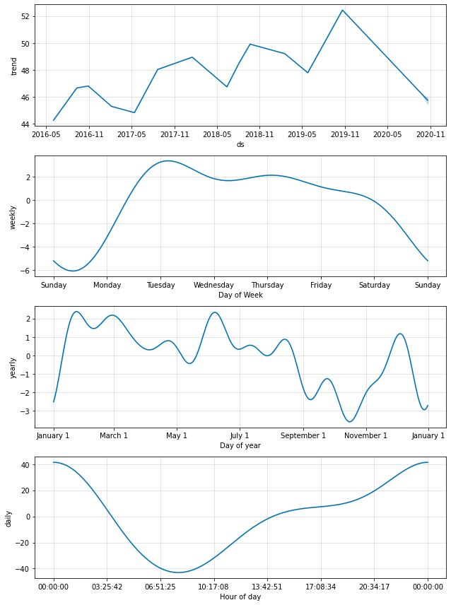 

### Step 5 (Optional): Forecast the Revenue by Using Time Series Models

A few weeks after your initial analysis, the finance group follows up to find out if you can help them solve a different problem. Your fame as a growth analyst in the company continues to grow!

Specifically, the finance group wants a forecast of the total sales for the next quarter. This will dramatically increase their ability to both plan budgets and help guide expectations for the company investors.

1. Interpret the Prophet model to identify any seasonal patterns in the company revenue. For example, what are the peak revenue days? (Mondays? Fridays? Something else?)

* As seen in the graphs below, the peak revenue day is Wednesday.

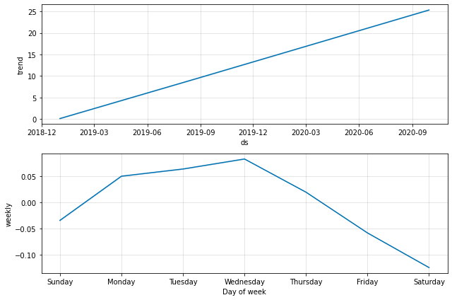 

2. Produce a sales forecast for the finance group. Give them a number for the expected total sales in the next quarter. Include the best- and worst-case scenarios to help them make better plans.

* Based on the above analysis, Mercado's Q3 Sales are most likely to be $2,163.70.  The worse case scenario would see $1,988.16 and the best case $2,339.24.

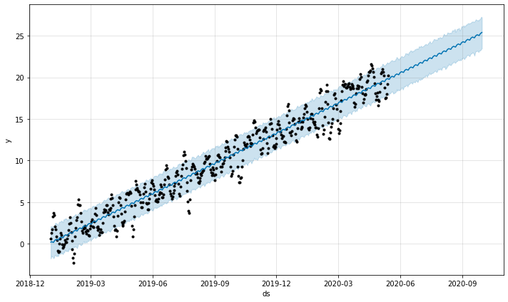 